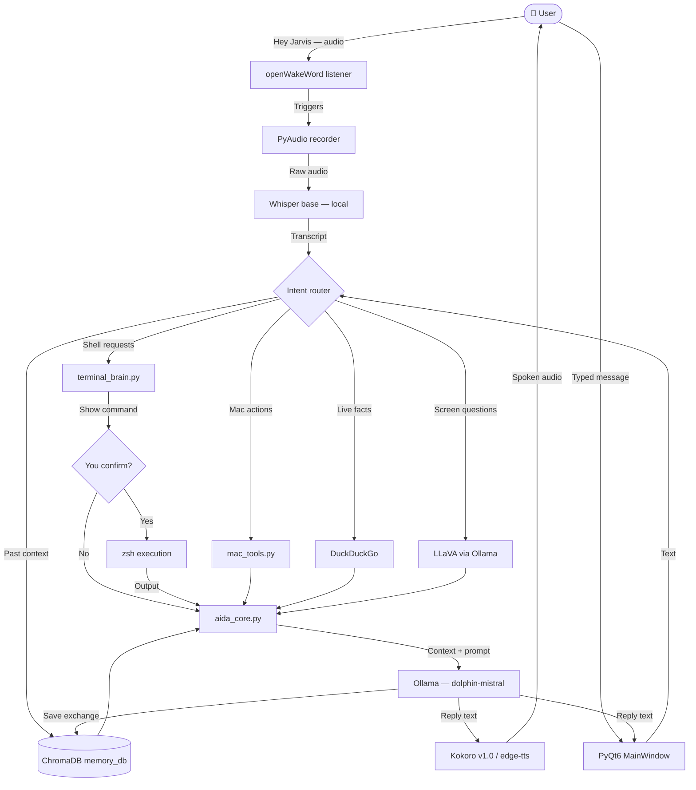

<div align="center">

# 🤖 AIDA

### Artificially Intelligent Digital Assistant

**A local-first voice assistant for macOS.**
Your Mac talks back, searches the web, reads your screen, and runs your terminal — without a single paid API key.

<p>
  
  
  
  
  
  
</p>

</div>

---

## Contents

- [What AIDA is](#what-aida-is)
- [Features](#features)
- [Architecture](#architecture)
- [Quick start](#quick-start)
- [Terminal Powerhouse](#terminal-powerhouse)
- [Talking to AIDA](#talking-to-aida)
- [Configuration](#configuration)
- [What stays on your Mac](#what-stays-on-your-mac)
- [Repository layout](#repository-layout)
- [Troubleshooting](#troubleshooting)
- [Status](#status)
- [Credits & license](#credits--license)

---

## What AIDA is

AIDA is a desktop assistant that runs on your own machine. The language model, the
vision model, the speech-to-text and (once set up) the speech synthesis all execute
locally — so there is no subscription, no metered token bill, and no account to create.

It ships as a **PyQt6 desktop app** with an animated orb, a live waveform, a chat log,
a text box, and an always-on wake-word listener. It can also translate plain English
into `zsh` commands and run them — but only after showing you the command and asking.

> **Two apps live in this repo.** `AIDA/` is the current app described below.
> `aida.py` in the repository root is the original v1 — a single-file terminal loop
> that uses the **Groq cloud API**. It is kept for reference; see
> [Repository layout](#repository-layout).

---

## Features

| | Capability | How it works |
|:--:|---|---|
| 🎙️ | **Wake word** | Always-on listener via openWakeWord — no button press needed |
| 🧠 | **Local LLM** | `dolphin-mistral` served by Ollama on `localhost:11434` |
| 👁️ | **Vision** | Captures the screen and describes it with the local LLaVA model |
| ⌨️ | **Terminal Powerhouse** | Plain English → `zsh`, shown and confirmed before it runs |
| 🔍 | **Web search** | DuckDuckGo for news, prices, people, weather — no API key |
| 📅 | **Calendar & reminders** | Reads today's events and adds reminders through AppleScript |
| 💻 | **Mac control** | Open apps and URLs, volume, battery, disk, lock screen, empty trash |
| 🎵 | **Spotify** | Play, pause, skip and track info via AppleScript |
| 🔔 | **Notifications** | Posts to macOS Notification Center |
| 📁 | **File reading** | Reads and summarises a file you point it at |
| 🗄️ | **Persistent memory** | ChromaDB store in `AIDA/memory_db/`, recalled when relevant |
| 🗣️ | **Speech** | Whisper `base` for listening, Kokoro v1.0 ONNX for speaking |

### The stack

| Layer | Tool | Runs | Cost |
|---|---|---|---|
| LLM | Ollama + `dolphin-mistral` | Local | Free |
| Vision | Ollama + `llava` | Local | Free |
| Wake word | openWakeWord (`hey_jarvis` model) | Local | Free |
| Speech-to-text | OpenAI Whisper `base` | Local | Free |
| Text-to-speech | Kokoro v1.0 ONNX, `edge-tts` fallback | Local / network fallback | Free |
| Search | `ddgs` (DuckDuckGo) | Network | Free |
| Memory | ChromaDB persistent client | Local | Free |
| System control | AppleScript + `subprocess` | Local | Free |
| GUI | PyQt6 | Local | Free |

---

## Architecture



---

## Quick start

### 1. Prerequisites

```bash
brew install portaudio ffmpeg ollama
ollama pull dolphin-mistral   # the main brain
ollama pull llava             # vision — skip if you don't need screen reading
```

Python 3.9 or newer is required (the code uses built-in generic type hints).

### 2. Install

```bash
git clone https://github.com/Nipunjaiswal442/aida.app.git
cd aida.app/AIDA
python3 -m venv venv
source venv/bin/activate
pip install -r requirements.txt
```

> The repo ships `kokoro-v1.0.onnx` (~40 MB), so the clone is not small.

### 3. Add the Kokoro voice pack

The ONNX model is in the repo, but its companion voice file is not. Without it AIDA
still speaks — it just falls back to `edge-tts`, which sends the reply text to
Microsoft's servers.

```bash
# from the AIDA/ directory
curl -L -o voices-v1.0.bin \
  https://github.com/thewh1teagle/kokoro-onnx/releases/download/model-files-v1.0/voices-v1.0.bin
```

### 4. Run

```bash
ollama serve &>/dev/null &   # skip if Ollama is already running
sleep 3
python3 main.py
```

macOS will ask for **Microphone**, **Automation** and **Screen Recording** permission the
first time each feature is used. Grant them in *System Settings → Privacy & Security*, or
the matching feature stays silent.

<details>
<summary><b>Optional: one-click launch from the Dock (Automator)</b></summary>

<br>

1. Open **Automator** → *New* → **Application**
2. Add a **Run Shell Script** action
3. Paste this, replacing the path with your own clone:

```bash
#!/bin/bash
# Apple Silicon: /opt/homebrew/bin/ollama — Intel: /usr/local/bin/ollama
/opt/homebrew/bin/ollama serve &>/dev/null &
sleep 5
cd "$HOME/aida.app/AIDA"
source venv/bin/activate
python3 main.py
```

4. Save it as **AIDA.app** and drag it to your Dock.

`AIDA/launch_aida.sh` is the same script; edit its hardcoded path before using it.

</details>

---

## Terminal Powerhouse

AIDA turns plain English into real `zsh` commands. It always shows you the command and
waits for a yes before anything executes.

| You say | AIDA proposes |
|---|---|
| "What's eating my CPU?" | `top -l 1 -n 10 -o cpu` |
| "How much disk space do I have?" | `df -h /` |
| "Find all files larger than 500MB" | `find ~ -size +500M -type f` |
| "Kill whatever is running on port 3000" | `kill $(lsof -t -i:3000)` |
| "Show me my last 10 commits" | `git log --oneline -10` |
| "Install httpie with brew" | `brew install httpie` |
| "Compress my Desktop folder" | `zip -r Desktop_backup.zip ~/Desktop` |
| "What's my public IP?" | `curl -s ifconfig.me` |
| "Show open network ports" | `sudo lsof -iTCP -sTCP:LISTEN -n -P` |
| "Clean up node_modules here" | `find . -name 'node_modules' -type d -prune -exec rm -rf '{}' +` |

**The guardrails, hardcoded in `terminal_brain.py`:**

- 🔍 The command is always shown before it runs
- ✅ Nothing executes without an explicit yes
- 📋 Every proposed command is copied to your clipboard
- 📝 Every request is logged to `AIDA/terminal_history.json`
- ⛔ A blacklist is refused outright even if you say yes — `rm -rf /`, disk wipes,
  fork bombs, `chmod 777 /` and friends

---

## Talking to AIDA

Say **"Hey Jarvis"** to wake it, then speak — or just type in the text box.

> **Why "Hey Jarvis"?** AIDA uses openWakeWord's stock `hey_jarvis` model as a stand-in.
> To make "Hey AIDA" work, train a custom model with
> [`AIDA/wakeword_training.md`](AIDA/wakeword_training.md) — a free Google Colab run,
> roughly 30–45 minutes.

| You say | AIDA does |
|---|---|
| "Search for the latest AI news" | Searches DuckDuckGo and summarises the results |
| "What's on my screen?" | Screenshots, then describes it with LLaVA |
| "What's on my calendar today?" | Reads Calendar.app via AppleScript |
| "Remind me to call mom" | Adds it to Reminders.app |
| "Set volume to 40" | Sets system volume |
| "How's my battery?" | Reports charge and power source |
| "Read file ~/Documents/notes.txt" | Reads and summarises it |
| "Open Spotify" / "Next track" | Launches and controls playback |
| "Lock my screen" | Sleeps the display |
| "What did we talk about yesterday?" | Recalls from ChromaDB memory |

### Live answers, not guesses

For anything time-sensitive AIDA fetches context before answering rather than trusting
the model's training data:

- **Local facts** — date, uptime, OS version, disk, battery, CPU, memory, IP, WiFi —
  come from safe read-only terminal snapshots.
- **External facts** — news, prices, scores, companies, weather — come from DuckDuckGo.

---

## Configuration

Edit the constants at the top of [`AIDA/aida_core.py`](AIDA/aida_core.py):

| Setting | Default | What it does |
|---|---|---|
| `OLLAMA_MODEL` | `dolphin-mistral` | The model Ollama serves |
| `OLLAMA_URL` | `http://localhost:11434/api/chat` | Where Ollama is listening |
| `OLLAMA_TIMEOUT` | `45` | Seconds before a generation is abandoned |
| `USE_KOKORO` | `True` | Local Kokoro TTS; falls back to `edge-tts` on failure |
| `VOICE` | `en-US-JennyNeural` | Voice used for the `edge-tts` fallback |
| `MAX_TOKENS` | `220` | Response length cap — raise for longer answers |
| `TEMPERATURE` | `0.7` | 0 is factual, 1 is creative |
| `MIN_RECORD_SEC` / `MAX_RECORD_SEC` | `1` / `15` | Bounds on a single spoken turn |
| `CONVERSATION_HISTORY_LIMIT` | `8` | Turns kept in short-term context |

`SYSTEM_PROMPT`, in the same file, is where AIDA's personality lives.

---

## What stays on your Mac

AIDA is local-first, not air-gapped. Here is the honest split:

| Component | Where it runs |
|---|---|
| LLM (`dolphin-mistral`) | 🟢 Your Mac, via Ollama |
| Vision (`llava`) | 🟢 Your Mac, via Ollama |
| Speech-to-text (Whisper) | 🟢 Your Mac |
| Kokoro TTS | 🟢 Your Mac |
| Conversation memory (ChromaDB) | 🟢 Your Mac, in `AIDA/memory_db/` |
| Terminal commands | 🟢 Your Mac, after you confirm |
| Web search | 🌐 Your **query** goes to DuckDuckGo |
| `edge-tts` fallback | 🌐 The **reply text** goes to Microsoft's TTS endpoint |

No account, no API key and no usage bill are involved either way. If you want AIDA
fully offline, install the Kokoro voice pack (so the `edge-tts` fallback never fires)
and avoid the search commands.

---

## Repository layout

```
aida.app/
├── AIDA/                      # ← the current app (v2)
│   ├── main.py                # Entry point — boots the PyQt6 GUI
│   ├── aida_core.py           # LLM, STT, TTS, memory, search, vision, routing
│   ├── terminal_brain.py      # English → zsh, blacklist, confirm, history log
│   ├── mac_tools.py           # AppleScript + system tools
│   ├── ui/
│   │   ├── main_window.py     # Main window, wake word wiring, text input
│   │   ├── orb_widget.py      # Animated orb
│   │   ├── waveform_widget.py # Live audio waveform
│   │   ├── hud_status_widget.py
│   │   └── chat_log_widget.py
│   ├── workers/               # QThread background workers
│   │   ├── wakeword_worker.py # openWakeWord listener
│   │   ├── listen_worker.py   # Audio capture
│   │   ├── transcribe_worker.py
│   │   ├── llm_worker.py
│   │   ├── speak_worker.py
│   │   ├── terminal_worker.py
│   │   └── tools_worker.py
│   ├── kokoro-v1.0.onnx       # Local TTS model (~40 MB, committed)
│   ├── launch_aida.sh         # Ollama + AIDA launcher (edit the path)
│   ├── wakeword_training.md   # Train your own "Hey AIDA"
│   ├── requirements.txt       # Pinned dependencies for the app
│   ├── memory_db/             # ChromaDB store (created on first run)
│   └── terminal_history.json  # Command log (created on first run)
│
├── aida.py                    # v1 — single-file terminal loop, Groq cloud API
├── config.py                  # v1 settings (voice, Groq model, recording length)
├── requirements.txt           # v1 dependencies
├── .env.example               # v1 — GROQ_API_KEY placeholder
└── assets/
```

<details>
<summary><b>Running the legacy v1 script</b></summary>

<br>

`aida.py` predates the desktop app. It records for a fixed five seconds, transcribes
with Whisper, answers with **LLaMA 3.1 through the Groq cloud API**, and speaks with
`edge-tts`. It needs a free Groq key and is **not** local-only.

```bash
pip install -r requirements.txt          # from the repository root
export GROQ_API_KEY="your_key_here"      # put this in ~/.zshrc, not in a file
python3 aida.py
```

Settings live in `config.py`; say "goodbye" or "exit" to quit.

</details>

---

## Troubleshooting

| Symptom | Fix |
|---|---|
| `Unable to access the microphone` | *System Settings → Privacy & Security → Microphone* → enable Terminal (or AIDA.app) |
| Ollama calls time out | `ollama serve` isn't running, or `ollama pull dolphin-mistral` was never done |
| Automator launcher does nothing | The `ollama` path differs by chip — `/opt/homebrew/bin` on Apple Silicon, `/usr/local/bin` on Intel |
| `ffmpeg not found` | `brew install ffmpeg`; when launched from Automator, `main.py` already patches both Homebrew paths onto `PATH` |
| `Failed to initialize Kokoro` | `voices-v1.0.bin` is missing — see [step 3](#3-add-the-kokoro-voice-pack). AIDA falls back to `edge-tts` |
| Wake word never fires | Say **"Hey Jarvis"**, not "Hey AIDA" — or train a custom model |
| Calendar or reminders do nothing | Approve the Automation prompt for Calendar.app / Reminders.app |
| First run is slow | Whisper downloads its `base` weights once; later runs are fast |

---

## Status

Everything on the original roadmap has shipped:

- [x] Local LLM via Ollama
- [x] Web search (DuckDuckGo)
- [x] Wake word detection
- [x] Persistent memory (ChromaDB)
- [x] Screenshot + vision (LLaVA)
- [x] Calendar + reminders
- [x] System control — volume, lock, trash, battery, disk
- [x] Spotify control via AppleScript
- [x] Notification Center integration
- [x] Custom wake word training guide
- [x] Fast local TTS with Kokoro v1.0
- [x] Terminal Powerhouse with confirm-before-run safety

---

## Credits & license

**Nipun Jaiswal** — VIT-AP University, CSE · [@Nipunjaiswal442](https://github.com/Nipunjaiswal442)

Scaffolded with [Claude](https://claude.ai) and [Antigravity](https://antigravity.dev).
Built on [Ollama](https://ollama.com), [openWakeWord](https://github.com/dscripka/openWakeWord),
[Whisper](https://github.com/openai/whisper), [Kokoro](https://github.com/thewh1teagle/kokoro-onnx),
[ChromaDB](https://www.trychroma.com) and [PyQt6](https://www.riverbankcomputing.com/software/pyqt/).

Released under the **MIT License**.

<div align="center">
<sub>Built for macOS · runs on your machine · costs nothing to use</sub>
</div>
